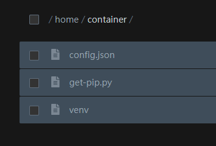

# 使用須知
在這裡，你會看到使用時須要注意的。

## 服務條款
1. 使用前，請先查看完成[服務條款](https://wayne227304.qzz.io/)。
2. 若服務條款裡面沒有的，您扔然須保持合格行為，禁止任何不該做的。
- 例如 : ddos我們的網頁.等

## 勿碰檔案

伺服器安裝完畢後您會發現您的伺服器目錄會有三個檔案

那麼這些檔案都是依賴項目，禁止刪除

將會導致伺服器無法開啟，我可無法救你

## 發現違規
若您發現/有人告訴您某某人的主機違反了服務條款，以及沒有正常使用

請立即告知客服，我們會盡快對此事調查

若您的舉報為實，我們會提高您最多幾台的伺服器

(例如 : 目前上限 5 台，舉報為實後更改為 6 台)

## 下一頁 :
下一頁為「控制面板」

請點擊「Next page」開始查看教學