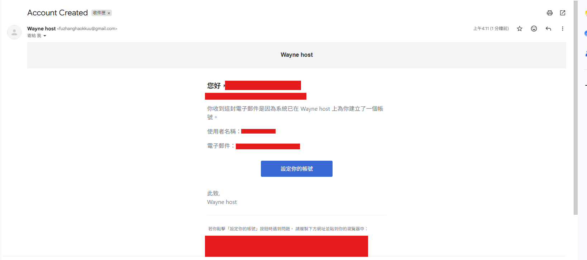
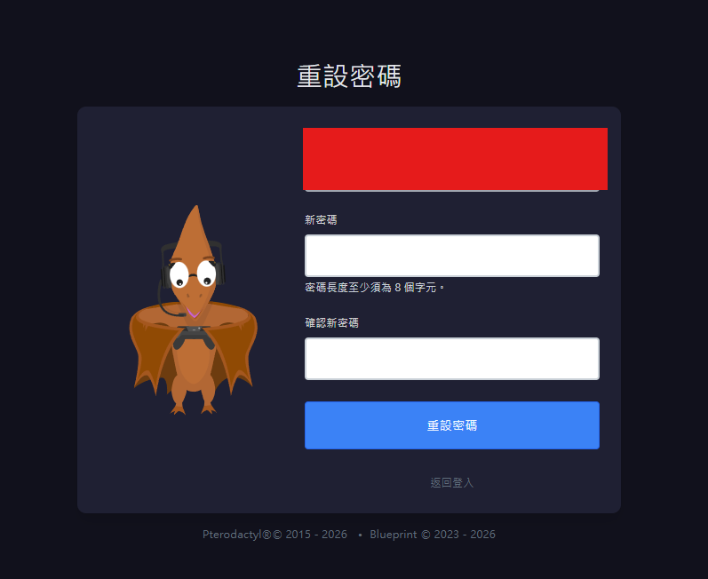
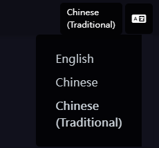

# Pterodactyl面板說明

## 1. 創建帳號
管理員會幫您創建帳號，創建帳號管理員會跟你說，

跟你說完之後請你至你的電子郵件查看，是否有 "fuzhanghaokkuu@gmail.com" 發送的郵件

若您看到，請點進去，會有一顆"設定您的按鈕"按鈕，同樣的，點進去

點進去之後，請在下方輸入你想要的密碼

輸入之後，這就是你登入面板的密碼

## 2. 語言切換
右上角有切換語言的地方，可以切換

分別是 : 1.英文(Englisj) 2.簡體中文(Chinese) 3.繁體中文(Chinese (Traditional))

## 3. 管理伺服器

## 抱歉 : (

## 文檔還未寫完，請見諒:<