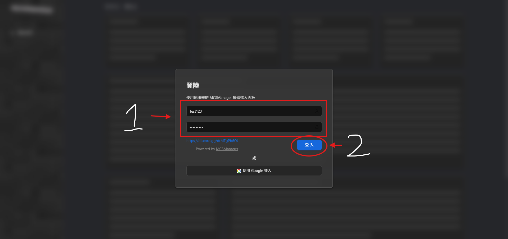
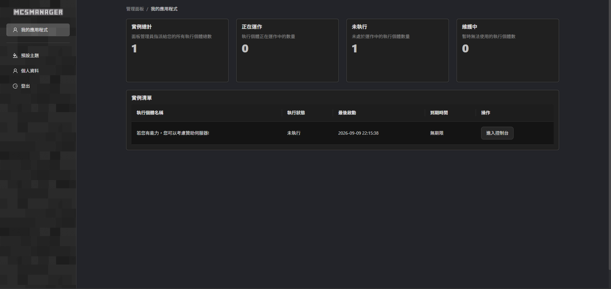
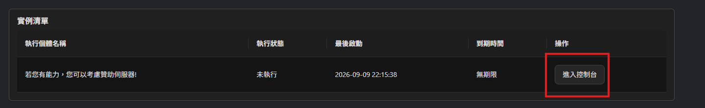
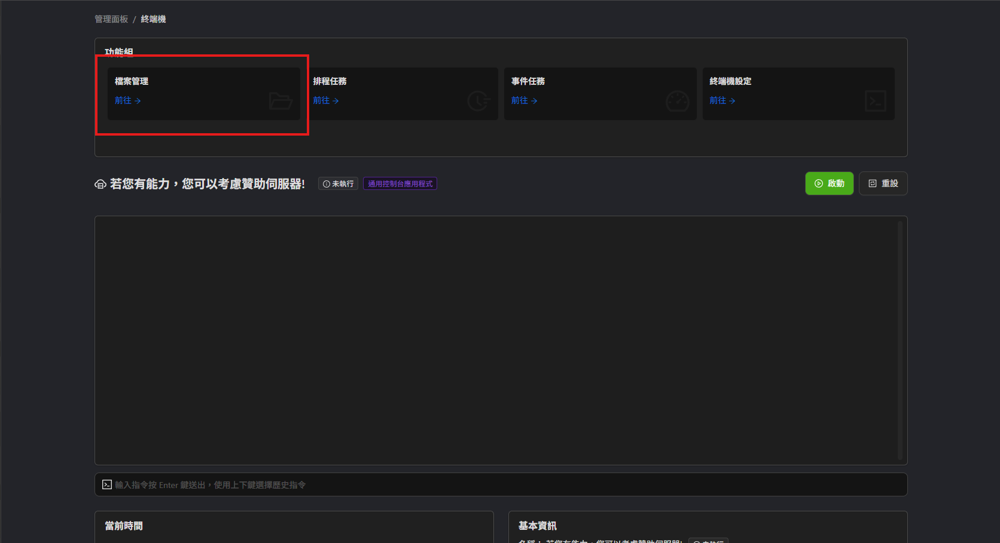
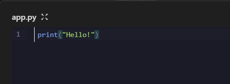
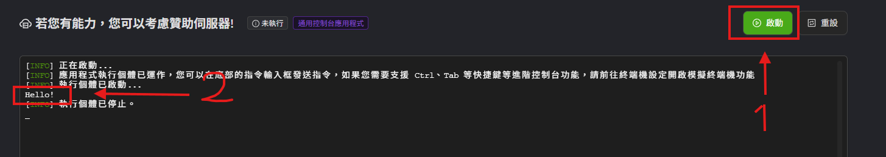

# 歡迎來到MCSM Panel教學

## 進入面板並登入
先輸入管理員給您的帳號以及密碼

輸入完之後在點擊下方的登入

## 登入完成後介紹面板

登入後，會有實例清單 (您的伺服器)

左側有 主題(深色.淺色) . 個人資料(不會用到) . 登出(字面意思)

我們先來看實例清單我們點擊「進入控制台」

進入控制台後，你會看到 控制台 功能組 等

點進去檔案管理

檔案管理的旁邊有新增，我們點新增檔案

空白檔案 --> 管理員通知您啟動檔案是啥(例如 : app.py 就填寫app.py)

填寫完畢後點進去，我們寫個print來做測試

寫完之後點下方「儲存」

儲存完畢後回到終端機，點啟動

**情況2:**

您選擇上傳Bot檔案

同樣的，若是管理員跟你說你的啟動檔案為app.py

那你機器人啟動的檔案若是其他名字，請更改為app.py

您的機器人才能正常運作。

## 到這裡就可以啦~

趕快試試看吧

## 下一頁 :
下一頁為「Pterodactyl面板教學」

請點擊「Next page」開始教學