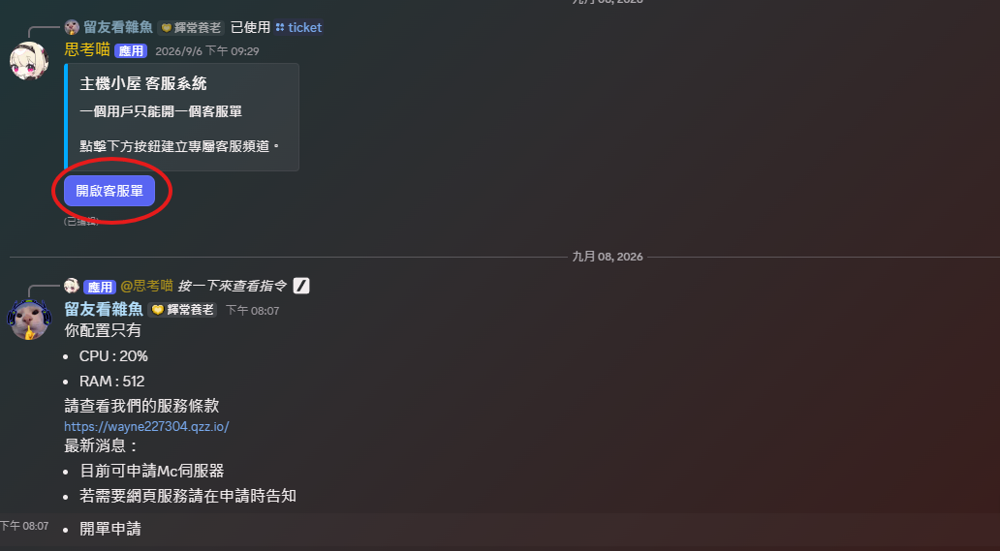

# 如何申請?
在這裡，你會看到申請的步驟，以及申請該給的資訊。

## 第一步，開單申請

首先你要到Discord頻道申請伺服器
1. 加入託管[Discord伺服器](https://discord.gg/drMFgPb6QJ)
2. 開單申請 [#［托管申請］](https://discord.com/channels/1522956743779287141/1528440297628106843)

3. 開啟客服單之後說說明你需要的環境語言.用途.專案邀請連結(Discord機器人).你的Email等資料 . 以及你要的節點位置

**面板選擇 | 強烈推薦使用面板二，面板二的UI較好用**


若您選擇[面板一](https://main.wayne227304.dpdns.org/)將是MCSM Panel

若您選擇[面板二](https://panel.wayne227304.dpdns.org/)將是Pterodactyl

**選擇面板一的需自行告訴管理員您要設定密碼**

::: tip
墨西哥 - 資源給你隨便用，較麻煩

台灣 - 資源限制，較方便，且好用
:::

**範例**
```md
您好，我需要一台Python伺服器
節點:墨西哥節點
我的用途為 Discord 機器人
這是我的專案邀請連結 : https://......
```
## 第二步，進入面板 (面板二)

查看電子郵件，若沒有收到電子郵件請到垃圾郵件查看

看到知道點選那個按鈕，輸入您想要的密碼


**此密碼需記住，管理員無法查看您設定的密碼，但可更改**

## 第三部，進入面板/註冊 完畢後
裡面就有您的伺服器啦

點按進去可能會有正在安裝的提示

請等待他安裝完畢

## 其他 :


::: warning
若您使用違反服務條款

以及非正常行為我們將有權將您的伺服器停權

尤其是墨西哥節點，並且我們不接受資料取回
:::

## 下一頁 :
下一頁為「使用須知」

請點擊「Next page」開始查看教學